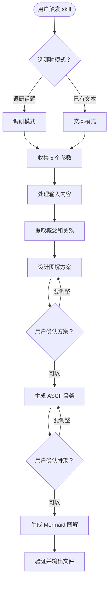
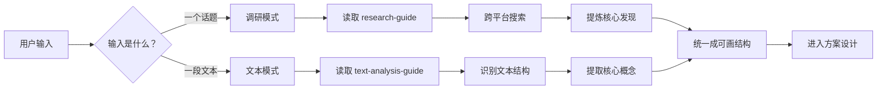
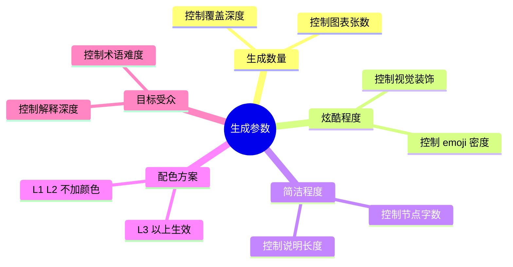
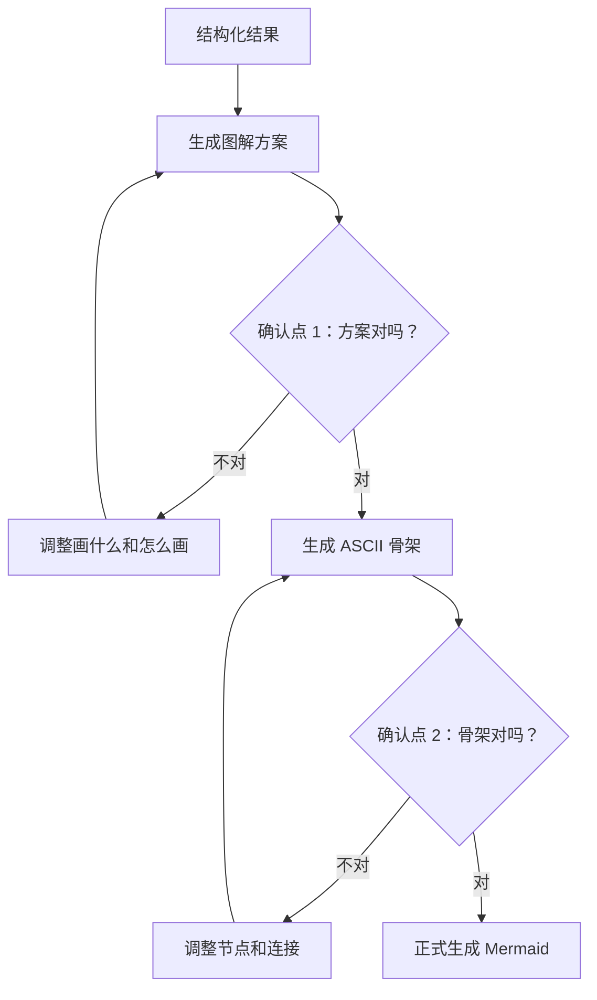
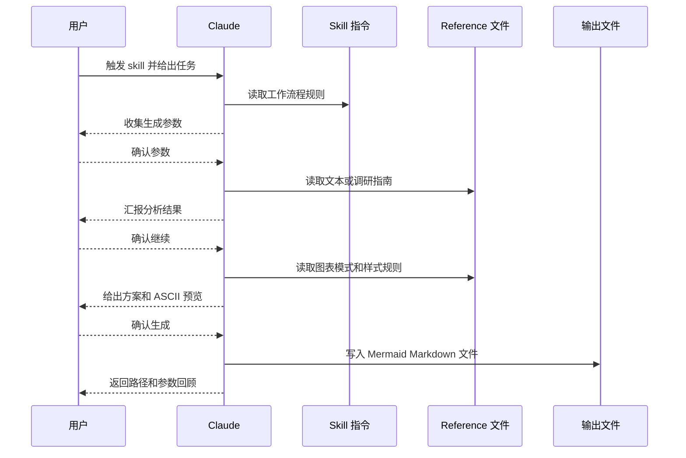
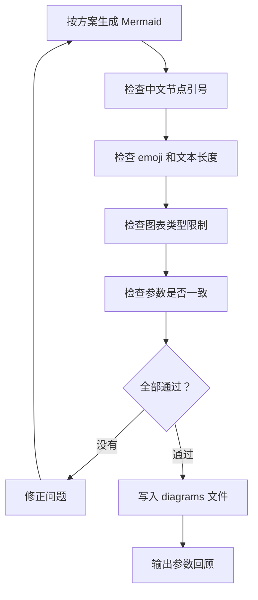

# mermaid-diagrm-auto - 图解系列

<!--
生成参数：
- 模式：文本
- 生成数量：标准 (6张)
- 炫酷程度：L2
- 简洁程度：中
- 配色方案：暖色系（L2 不生成配色）
- 目标受众：进阶
-->

---

## 首页：这个 Skill 怎么工作？ 🧭

- 它不是直接开画，而是先判断输入模式
- 它用 5 个参数控制图解数量、风格和表达深度
- 它会先把输入整理成概念、关系和叙事顺序
- 它有两道人类确认点，避免画偏
- 最后才生成 Mermaid，并按清单验证

---

## 图 1: 总体工作流 🚦

这张图是总览：真正的 Mermaid 生成其实在很后面，前面大部分时间都在理解、设计和确认。

---

## 图 2: 两种输入模式 🔀

调研模式和文本模式前半段不一样，但它们会被整理成同一种结构，所以下游画图流程可以复用。

---

## 图 3: 参数控制台 🕹️

这 5 个参数像一个控制台：数量决定画多少，炫酷决定视觉密度，简洁决定节点文字，受众决定说话方式。

---

## 图 4: 双重人工确认 🧑‍⚖️

这就是这个 skill 很关键的地方：先确认“画什么”，再确认“大概长什么样”，最后才动手生成正式代码。

---

## 图 5: 用户、Claude、参考文件怎么协作 💬

这张图强调交互顺序：用户不是只在开头说一句话，而是在关键节点参与确认。

---

## 图 6: 生成与验证闭环 ✅

最后一步不是写完就算了，还要按清单检查：语法、参数、风格、数量和叙事连贯性都要对上。

---

*生成于 2026-07-08 | 模式: 文本 | 数量: 标准 | 炫酷: L2 | 简洁: 中 | 配色: 暖色系 | 受众: 进阶*
